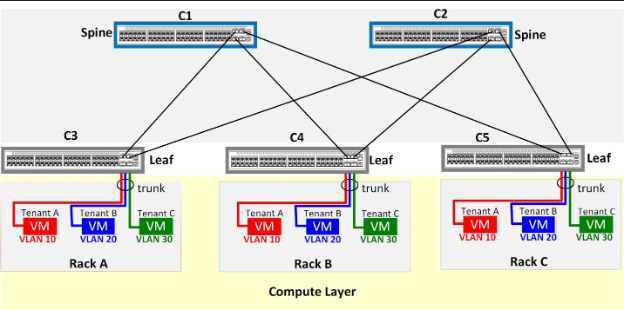
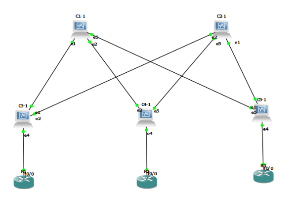

# EVPN-VXLAN-Cumulus-Linux

## Objective
Simulated project for an EVPN-VXLAN network using Cumulus Linux Devices on GNS3

## Topology

## Requirements
- There are 5 Cumulus Linux Devices, with two spine and three leaf routers
- Each leaf router advertises three VLANs (10,20,30) for three tenants (Red, Blue, Green)
- The tenant devices named VM are simulated with a Router-On-A-Stick method
- There are 3 MAC addresses per VXLAN

### Simulated Tenants with ROAS

